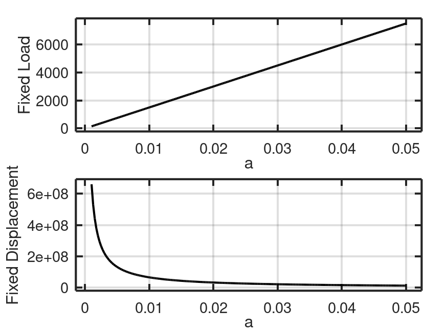

## 🔹 Total potential energy

$$
\Pi = U_{strain} - W_{\text{ext}} + \Gamma
$$

where  

- $U_{\text{strain}}$: stored elastic energy  
- $W_{\text{ext}}$: external work  
- $\Gamma = G_c A$: fracture (surface) energy  

---

#### 🔹 Energy-release rate

$$
G = -\frac{d\Pi}{dA}
$$

\(G\) is the energy released **per unit increase** in crack surface area \(A\).

---

#### 🔹 Griffith fracture criterion

$$
G = G_c
$$

Crack propagates when the **available energy** \(G\) equals the **required surface energy** \(G_c\).

---

#### 🔹 Typical analytic forms

- **Fixed load (stress-controlled):**
  
  $$
  G = \frac{\sigma^2 \pi a}{E'}
  $$

- **Fixed displacement (strain-controlled):**
  
  $$
  G = \frac{E' \pi \delta^2}{a}
  $$

where  
$$
E' =
\begin{cases}
E, & \text{plane stress} \\[4pt]
\dfrac{E}{1-\nu^2}, & \text{plane strain}
\end{cases}
$$

---

## Energy Release Rate

---

- **More** energy is released when the crack length increases under fixed load compared to fixed displacement.
- Less load is required to propagate a crack under fixed load conditions.

---

#### 🔹 Interpretation

- \($G > 0$\): energy released from system  
- \($G < G_c$\): crack stable  
- \($G = G_c$\): steady growth  
- \($G > G_c$\): unstable fracture

---
