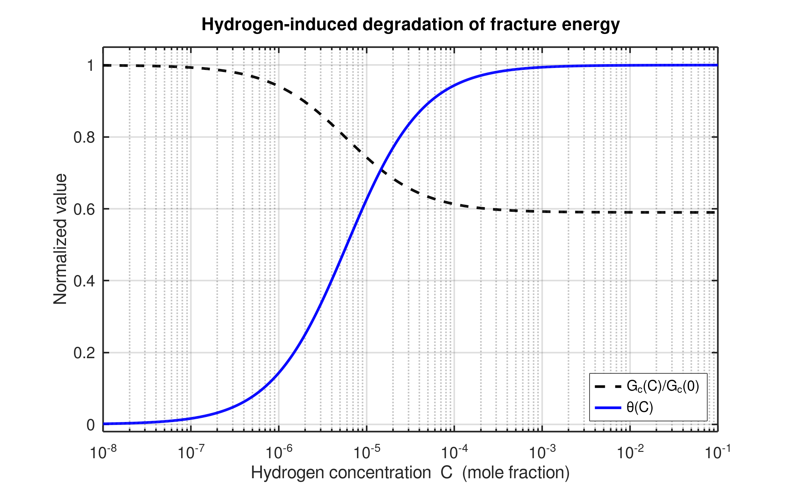

# Hydrogen Effect on Fracture Energy

---

## 1. Hydrogen Coverage

Hydrogen coverage (fraction of occupied trap sites) follows the **Langmuir–McLean isotherm**:

$$
\theta = \frac{C}{C + \exp\!\left(-\frac{\Delta g_b^0}{RT}\right)}
$$

where:

| Symbol | Meaning |
|:-------:|:--------|
| \( $\theta$ \)                                 | Fraction of occupied traps |
| \( C \) | Hydrogen concentration (mole fraction) |
| \( $\Delta g_b^0$ \) | Binding free energy (J/mol) |
| \( R \) | Gas constant (8.314 J/mol·K) |
| \( T \) | Temperature (K) |

This equation gives a **sigmoidal dependence** of trap occupancy on bulk hydrogen concentration.

---

## 2. Fracture Energy Degradation

The **hydrogen-affected critical energy release rate** (fracture toughness) is modeled as:

$$
\frac{G_c(\theta)}{G_c(0)} = 1 - \chi\,\theta
$$

where \( \chi \) is the **hydrogen sensitivity coefficient** (usually between 0.3 and 0.5).

---

## 3. Combined Relationship

Combining both gives:
,
$$
\frac{G_c(C)}{G_c(0)} = 1 - \chi \,
\frac{C}{C + \exp\!\left(-\frac{\Delta g_b^0}{RT}\right)}
$$

So:
- \( \theta(C) \) increases with hydrogen concentration,
- \( G_c(C)/G_c(0) \) decreases as hydrogen coverage increases.

---

## 4. Conceptual Plot

| Variable | Meaning |
|:--|:--|
| **Blue curve** | \( $\theta(C)$ \): Hydrogen coverage (sigmoidal) |
| **Black dashed curve** | \( G_c(C)/G_c($\theta$) = 1 - \chi\theta(C) \): Fracture energy degradation |

The resulting figure looks like this:

---

## 5. Physical Summary

- \( $\theta$ \): probability that a trap is filled with hydrogen  
- \( 1 - \chi\theta \): remaining fraction of fracture resistance  
- In phase-field models:  
  \( $G_c(\phi$, C) = G_{c0}\,(1 - $\chi$ $\theta(C))$ \)

---

> **Interpretation:**  
> As hydrogen concentration increases, more traps are filled → \( \theta ↑ \) → \( G_c ↓ \).  
> This leads to **hydrogen-assisted embrittlement**, captured naturally by this coupled relationship.

